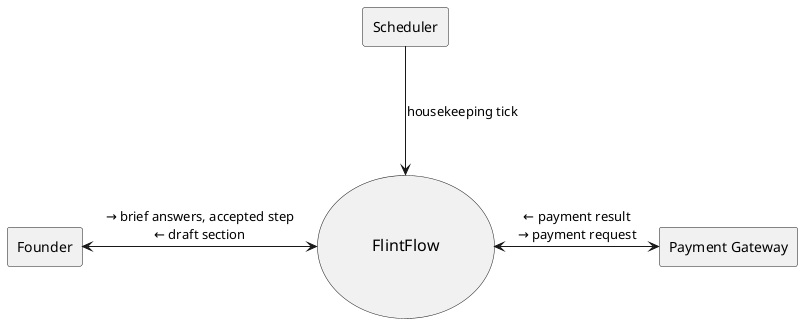
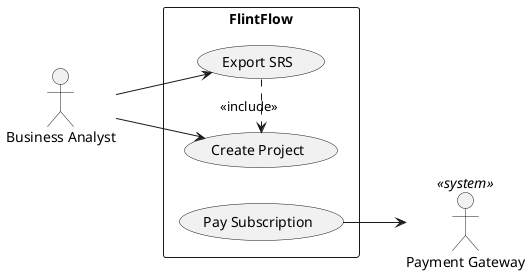
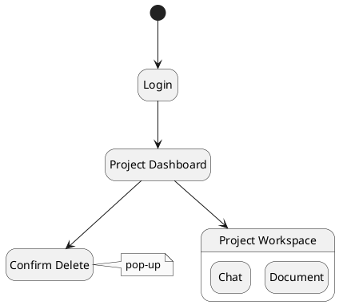
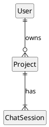
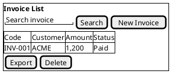

# Per-kind skeletons — source: Phases §7; srs-spine.md §7.1

## `context` — §1 System Context

Source fields: `project.name` · `actors[].name/.kind/.flows_in/.flows_out` · `use_cases[].name/.actor_ids`. Level-0 data flow: system circle in the centre, actors ringed around it, one labelled arrow per direction (`flows_in` into the system, `flows_out` out of it), falling back to the actor's use case names (max 3, then `+ N more`).

## `usecase` — §2.2.1

Source fields: `actors[].name/.kind` · `use_cases[].name/.actor_ids/.includes/.extends`.

- `includes[]` → `base .> included : <<include>>`
- `extends[]` → `extension .> base : <<extend>>`
- `kind = time` actors: `actor "Scheduler" as A08 <<time>>`

## `screen_flow` — §3.1.1

Source fields: `screens[].name/.flow_to/.is_popup/.tabs`.

- Screens with `tabs[]` → composite state, one sub-state per tab (`<screen>_T<n>`).
- `is_popup = true` → attach `note … : pop-up`.

## `erd` — §3.1.5

Source fields: `entities[].name/.relations`. Attributes are **not** drawn (not in source fields).

Crow's foot: `||` exactly one · `|o` zero or one · `}|` one or many · `}o` zero or many.

## `screen_layout` — §3.x.y (core screens only, Phases §7.2)

Source fields: `screens[<owner>].name` · `functions[screen_id=<owner>].name/.description`. Attached to `screens[].primary_function_id`.

- Low-fi on purpose: what the screen has and does, not how it looks.
- Repeated CRUD admin screens: one template salt + a variant table, not one salt each.
- `@startsalt … @endsalt` replaces `@startuml … @enduml` for this kind only.
