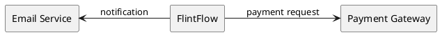
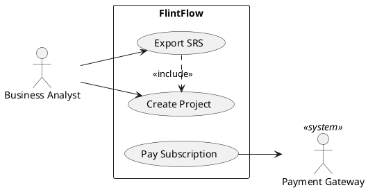
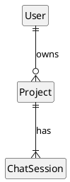
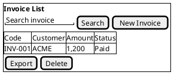

# Per-kind skeletons — source: Phases §7; srs-spine.md §7.1

## `context` — §1 System Context

Source fields: `project.name` · `actors[kind≠human].name`. Human actor groups may appear as one `actor` for readability only if already present in `actors[]`.



## `usecase` — §2.2.1

Source fields: `actors[].name/.kind` · `use_cases[].name/.actor_ids/.includes/.extends`.



- `includes[]` → `base .> included : <<include>>`
- `extends[]` → `extension .> base : <<extend>>`
- `kind = time` actors: `actor "Scheduler" as A08 <<time>>`

## `screen_flow` — §3.1.1

Source fields: `screens[].name/.flow_to/.is_popup/.tabs` + the human actor each screen serves.

**Graphviz DOT, not a state diagram**: the flow starts at a diamond with the actor name inside, and a
PlantUML state diagram cannot label a diamond. One part per human actor that uses the UI (graph label
`Screens flow for <actor>`, also the image caption), holding only that actor's screens and the edges between
them; screens no human actor uses go to a last `Unassigned screens` part (black-dot start) and raise
`orphan_screen`. Before any screen ↔ actor link exists: one unlabelled diagram, black-dot start. Arrows are
one-way: of a pair pointing at each other only the forward edge (away from the entry) is drawn.

```
@startdot
digraph screens_flow {
  graph [fontname="DejaVu Sans", fontsize=13, labelloc=t, compound=true, nodesep=0.4, ranksep=0.5];
  node [fontname="DejaVu Sans", fontsize=11, shape=box, style=rounded, color="#000000"];
  edge [arrowsize=0.8];
  label="Screens flow for Founder";
  START [label="Founder", shape=diamond, style=solid];
  S1 [label="Login"];
  S2 [label="Project Dashboard"];
  subgraph cluster_S3 {
    label="Project Workspace"; style=rounded;
    S3_T1 [label="Chat"];
    S3_T2 [label="Document"];
  }
  S4 [label="Confirm Delete\n(pop-up)", style="rounded,dashed"];
  START -> S1;
  S1 -> S2;
  S2 -> S3_T1 [lhead=cluster_S3];
  S2 -> S4;
}
@enddot
```

- Screens with `tabs[]` → `subgraph cluster_<screen>`, one node per tab (`<screen>_T<n>`); edges attach to
  `_T1` with `lhead` / `ltail`.
- `is_popup = true` → dashed border + `(pop-up)` line. Boxes are not filled (PlantUML drops the border of a
  `rounded,filled` node). Font `DejaVu Sans` is required — the default dot font is missing in the image.

## `erd` — §3.1.5

Source fields: `entities[].name/.relations`. Attributes are **not** drawn (not in source fields).



Crow's foot: `||` exactly one · `|o` zero or one · `}|` one or many · `}o` zero or many.

## `screen_layout` — §3.x.y (core screens only, Phases §7.2)

Source fields: `screens[<owner>].name` · `functions[screen_id=<owner>].name/.description`. Attached to `screens[].primary_function_id`.



- Low-fi on purpose: what the screen has and does, not how it looks.
- Repeated CRUD admin screens: one template salt + a variant table, not one salt each.
- `@startsalt … @endsalt` replaces `@startuml … @enduml` for this kind only.
