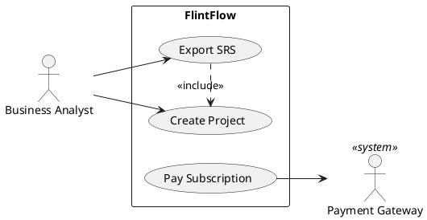
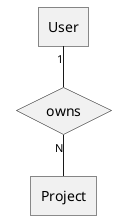
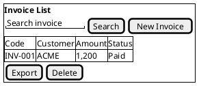

# Per-kind skeletons — source: Phases §7; srs-spine.md §7.1

## `context` — §1 System Context

Source fields: `project.system_name ?? project.name` · `actors[].name/.kind/.flows_in/.flows_out` · `use_cases[].name/.actor_ids`. Level-0 data flow: a compact circle (`shape=circle`, equal width/height) in the centre. Actors with ONE resolved in/out pair are distributed evenly above/below it (id order, ties top); actors with TWO or more pairs go left/right, balancing total pair counts between sides (id order, ties left). Graphviz DOT with `nop2` preserves the shapes, unique ports, explicit cubic paths and label positions computed in `context-layout.ts`. Arrows curve inward from the actor lanes to distinct ports on the circle; controls stay in separate sectors. Positions (`pos`, `lp`) are in points, dimensions in inches. ONE requirement/output per visible arrow, with its own edge label; the renderer gives flow labels a borderless white HTML backing. Pair `flows_in[i]` (into the system) with `flows_out[i]` (out of it): N exchanges ⇒ N in-arrows + N out-arrows. Never join labels, truncate them or emit `+ N more`. Prefer explicit flow lists. Legacy missing items use response/acknowledgement labels at the corresponding index, or use-case request/result pairs when both lists are absent. See `renderer/context` for fallback rules. The following minimal skeleton uses plain edge labels for readability.


```plantuml
@startdot
digraph Context {
  graph [layout=nop2, overlap=true, splines=true, bgcolor="white", outputorder=edgesfirst];
  node [fontname="sans-serif", fontsize=14, fixedsize=true, pin=true, style=filled, fillcolor="white", color="#64748B"];
  edge [fontname="sans-serif", fontsize=12, color="#475569", fontcolor="#334155", headclip=false, tailclip=false];
  SYSTEM_ [shape=circle, pos="0,0!", width=2.777778, height=2.777778, label="FlintFlow", fillcolor="#F1F5F9"];
  A01 [shape=box, pos="-306,0!", width=1.5, height=2, label="Founder"];
  A01_IN_0 [shape=point, style=invis, width=0, height=0, label="", pos="-252,54!"];
  SYSTEM_A01_IN_0 [shape=point, style=invis, width=0, height=0, label="", pos="-93.29523,36!"];
  A01_OUT_0 [shape=point, style=invis, width=0, height=0, label="", pos="-252,18!"];
  SYSTEM_A01_OUT_0 [shape=point, style=invis, width=0, height=0, label="", pos="-99.27739,12!"];
  A01_IN_1 [shape=point, style=invis, width=0, height=0, label="", pos="-252,-18!"];
  SYSTEM_A01_IN_1 [shape=point, style=invis, width=0, height=0, label="", pos="-99.27739,-12!"];
  A01_OUT_1 [shape=point, style=invis, width=0, height=0, label="", pos="-252,-54!"];
  SYSTEM_A01_OUT_1 [shape=point, style=invis, width=0, height=0, label="", pos="-93.29523,-36!"];
  A01_IN_0 -> SYSTEM_A01_IN_0 [label="Brief answers", pos="e,-93.29523,36 -252,54 -199.098,57.58 -146.196,51.58 -101.29523,38.3", lp="-210,71"];
  SYSTEM_A01_OUT_0 -> A01_OUT_0 [label="Draft section", pos="e,-252,18 -99.27739,12 -150.185,23.33 -201.092,25.33 -244,19.15", lp="-210,35"];
  A01_IN_1 -> SYSTEM_A01_IN_1 [label="Project request", pos="e,-99.27739,-12 -252,-18 -201.092,-25.33 -150.185,-23.33 -107.27739,-13.78", lp="-210,-35"];
  SYSTEM_A01_OUT_1 -> A01_OUT_1 [label="Created project", pos="e,-252,-54 -93.29523,-36 -146.196,-51.58 -199.098,-57.58 -244,-54.54", lp="-210,-71"];
}
@enddot
```

## `usecase` — §2.2.1

Source fields: `actors[].name/.kind` · `use_cases[].name/.actor_ids/.includes/.extends`.


```plantuml
@startuml
skinparam monochrome true
left to right direction
actor "Business Analyst" as A01
actor "Payment Gateway" as A05 <<system>>
rectangle "FlintFlow" {
  usecase "Create Project" as UC01
  usecase "Export SRS" as UC07
  usecase "Pay Subscription" as UC09
}
A01 --> UC01
A01 --> UC07
UC09 --> A05
UC07 .> UC01 : <<include>>
@enduml
```

- `includes[]` → `base .> included : <<include>>`
- `extends[]` → `extension .> base : <<extend>>`
- `kind = time` actors: `actor "Scheduler" as A08 <<time>>`

## `screen_flow` — §3.1.1

Source fields: `screens[].name/.flow_to/.is_popup/.tabs` + the human actor each screen serves.

**Graphviz DOT, not a state diagram**: the flow starts at a diamond with the actor name inside, and a
PlantUML state diagram cannot label a diamond. One part per human actor that uses the UI (graph label
`Screens flow for <actor>`, also the image caption), holding only that actor's screens and the edges between
them. No part for unassigned screens: a public screen (granted only to a role with no actor, e.g. Guest on
Login) is drawn in every human actor's part; a public landing page and Register are entries beside Login
(Login stays an entry despite `Register → Login`); any other
screen no human actor uses is not drawn and raises `orphan_screen`. Before any screen ↔ actor link exists: one unlabelled diagram, black-dot start. Arrows are
one-way: of a pair pointing at each other only the forward edge (away from the entry) is drawn.

```
@startdot
digraph screens_flow {
  graph [fontname="DejaVu Sans", fontsize=13, labelloc=t, compound=true, nodesep=0.4, ranksep=0.5];
  node [fontname="DejaVu Sans", fontsize=11, shape=box, color="#000000"];
  edge [arrowsize=0.8];
  label="Screens flow for Founder";
  START [label="Founder", shape=diamond, style=solid];
  S1 [label="Login"];
  S2 [label="Project Dashboard"];
  subgraph cluster_S3 {
    label="Project Workspace"; style=solid;
    S3_T1 [label="Chat"];
    S3_T2 [label="Document"];
  }
  S4 [label="Confirm Delete", shape=ellipse];
  START -> S1;
  S1 -> S2;
  S2 -> S3_T1 [lhead=cluster_S3];
  S2 -> S4;
}
@enddot
```

- Screens with `tabs[]` → `subgraph cluster_<screen>`, one node per tab (`<screen>_T<n>`); edges attach to
  `_T1` with `lhead` / `ltail`.
- Screen = rectangle (`shape=box`); `is_popup = true` → oval (`shape=ellipse`), name only (no `(pop-up)` text). Shapes are not filled (PlantUML drops the border of a
  `rounded,filled` node). Font `DejaVu Sans` is required — the default dot font is missing in the image.

## `erd` — §3.1.5

Source fields: `entities[].name/.relations/.relation_verbs/.relation_cardinality/.relation_optional`. Attributes are **not** drawn (not in source fields).
Chen notation: entity = rectangle, each relation = a diamond holding a lowercase verb (`relation_verbs`, `has`
when missing). Braces after `entity` / `relationship` are required even when empty.


```plantuml
@startchen
skinparam monochrome true
skinparam ranksep 20
skinparam linetype ortho
entity "User" as E1 {
}
entity "Project" as E2 {
}
relationship "owns" as R_E1_E2 {
}
E1 -1- R_E1_E2
R_E1_E2 -N- E2
@endchen
```

Cardinality labels on the lines: `-1-` one · `-N-` many · `-(0,1)-` optional one. The parent side is `1`, or `(0,1)` when the child is in `relation_optional` (never `-0..1-`: a syntax error in `@startchen`); the child side is `relation_cardinality[<child>]`, `N` when missing.

## `screen_layout` — §3.x.y (core screens only, Phases §7.2)

Source fields: `screens[<owner>].name` · `functions[screen_id=<owner>].name/.description`. Attached to `screens[].primary_function_id`.


```plantuml
@startsalt
{+
  <b>Invoice List
  { "Search invoice" | [Search] | [New Invoice] }
  {#
    Code | Customer | Amount | Status
    INV-001 | ACME | 1,200 | Paid
  }
  { [Export] | [Delete] }
}
@endsalt
```

- Low-fi on purpose: what the screen has and does, not how it looks.
- Repeated CRUD admin screens: one template salt + a variant table, not one salt each.
- `@startsalt … @endsalt` replaces `@startuml … @enduml` for this kind only.
