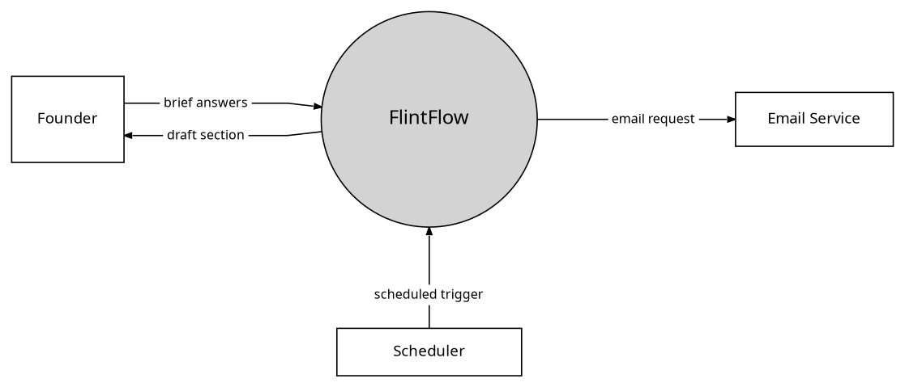
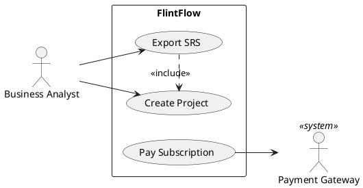
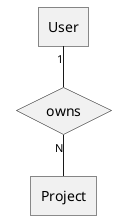
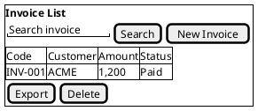

# Per-kind skeletons — source: Phases §7; srs-spine.md §7.1

## `context` — §1 System Context

Source fields: `project.system_name ?? project.name` · `actors[].name/.kind/.flows_in/.flows_out`. Level-0 data flow (context diagram), black and white with a light grey system circle: ONE process — the system as a true circle in the centre — and external entities as plain boxes ringed around it by role (`human` left/`west`, `system` right/`east`, `time` below/`south`; `north` only on overflow). Every `flows_in` item (actor → system) and every `flows_out` item (system → actor) is its own arrow with one data-noun label; one-way actors draw only the arrows that exist — never pair lists by index or invent a counterpart — but the diagram as a whole always has both directions. Every arrow carries data: more than 3 items in a direction ⇒ first 2 + a third arrow joining the rest with `, ` (never `+ N more`); missing flows get a fallback label by kind. Graphviz DOT with `nop2` keeps the geometry computed in `context-layout.ts`: a straight leg from the box holding the label, then one convex cubic into the circle; positions (`pos`, `lp`) in points, dimensions in inches. See `renderer/context` for the full rules. Generated example (the time actor has no flows and falls back to `scheduled trigger`):


```plantuml
@startdot
digraph Context {
  graph [layout=nop2, overlap=true, splines=true, bgcolor="white", pad=0.15, outputorder=edgesfirst];
  node [fontname="sans-serif", fontsize=14, fontcolor="black", fixedsize=true, pin=true, style=filled, color="black", fillcolor="white", penwidth=1.2];
  edge [fontname="sans-serif", fontsize=12, color="black", fontcolor="black", penwidth=1.2, arrowsize=0.7, headclip=false, tailclip=false];
  SYSTEM_ [shape=circle, pos="0,0!", width=2.777778, height=2.777778, label="FlintFlow", fontsize=18, fillcolor="lightgray"];
  A01 [shape=box, pos="-334.544958,0.000000!", width=1.444444, height=1.111111, label="Founder", sector="west"];
  A02 [shape=box, pos="356.550000,0.000000!", width=2.031944, height=0.694444, label="Email Service", sector="east"];
  A03 [shape=box, pos="0.000000,-216.000000!", width=2.369444, height=0.611111, label="Scheduler", sector="south"];
  A01_IN_0 [shape=point, style=invis, width=0, height=0, label="", pos="-282.544958,15.000000!"];
  SYSTEM_A01_IN_0 [shape=point, style=invis, width=0, height=0, label="", pos="-99.352241,11.363636!"];
  SYSTEM_A01_OUT_0 [shape=point, style=invis, width=0, height=0, label="", pos="-99.352241,-11.363636!"];
  A01_OUT_0 [shape=point, style=invis, width=0, height=0, label="", pos="-282.544958,-15.000000!"];
  SYSTEM_A02_OUT_0 [shape=point, style=invis, width=0, height=0, label="", pos="100.000000,0.000000!"];
  A02_OUT_0 [shape=point, style=invis, width=0, height=0, label="", pos="283.400000,0.000000!"];
  A03_IN_0 [shape=point, style=invis, width=0, height=0, label="", pos="0.000000,-194.000000!"];
  SYSTEM_A03_IN_0 [shape=point, style=invis, width=0, height=0, label="", pos="0.000000,-100.000000!"];
  A01_IN_0 -> SYSTEM_A01_IN_0 [label=<<TABLE BORDER="0" CELLBORDER="0" CELLSPACING="0" CELLPADDING="3" BGCOLOR="white"><TR><TD>brief answers</TD></TR></TABLE>>, actor_id="A01", flow="in", flow_index=0, pos="e,-99.352241,11.363636 -282.544958,15.000000 -232.078291,15.000000 -181.611625,15.000000 -131.144958,15.000000 -131.144958,15.000000 -120.973156,13.836577 -107.300420,12.272727", lp="-206.844958,15.000000"];
  SYSTEM_A01_OUT_0 -> A01_OUT_0 [label=<<TABLE BORDER="0" CELLBORDER="0" CELLSPACING="0" CELLPADDING="3" BGCOLOR="white"><TR><TD>draft section</TD></TR></TABLE>>, actor_id="A01", flow="out", flow_index=0, pos="e,-282.544958,-15.000000 -99.352241,-11.363636 -116.838235,-13.363636 -131.144958,-15.000000 -131.144958,-15.000000 -178.944958,-15.000000 -226.744958,-15.000000 -274.544958,-15.000000", lp="-206.844958,-15.000000"];
  SYSTEM_A02_OUT_0 -> A02_OUT_0 [label=<<TABLE BORDER="0" CELLBORDER="0" CELLSPACING="0" CELLPADDING="3" BGCOLOR="white"><TR><TD>email request</TD></TR></TABLE>>, actor_id="A02", flow="out", flow_index=0, pos="e,283.400000,0.000000 100.000000,0.000000 117.600000,0.000000 132.000000,0.000000 132.000000,0.000000 179.800000,0.000000 227.600000,0.000000 275.400000,0.000000", lp="207.700000,0.000000"];
  A03_IN_0 -> SYSTEM_A03_IN_0 [label=<<TABLE BORDER="0" CELLBORDER="0" CELLSPACING="0" CELLPADDING="3" BGCOLOR="white"><TR><TD>scheduled trigger</TD></TR></TABLE>>, actor_id="A03", flow="in", flow_index=0, pos="e,0.000000,-100.000000 0.000000,-194.000000 0.000000,-173.333333 0.000000,-152.666667 0.000000,-132.000000 0.000000,-132.000000 0.000000,-121.761880 0.000000,-108.000000", lp="0.000000,-163.000000"];
}
@enddot
```

## `usecase` — §2.2.1

Source fields: `actors[].name/.kind` · `use_cases[].name/.actor_ids/.includes/.extends`.


```plantuml
@startuml
skinparam monochrome true
left to right direction
actor "Business Analyst" as A01
actor "Payment Gateway" as A05 <<system>>
rectangle "FlintFlow" {
  usecase "Create Project" as UC01
  usecase "Export SRS" as UC07
  usecase "Pay Subscription" as UC09
}
A01 --> UC01
A01 --> UC07
UC09 --> A05
UC07 .> UC01 : <<include>>
@enduml
```

- `includes[]` → `base .> included : <<include>>`
- `extends[]` → `extension .> base : <<extend>>`
- `kind = time` actors: `actor "Scheduler" as A08 <<time>>`

## `screen_flow` — §3.1.1

Source fields: `screens[].name/.flow_to/.is_popup/.tabs` + the human actor each screen serves.

**Graphviz DOT, not a state diagram**: the flow starts at a diamond with the actor name inside, and a
PlantUML state diagram cannot label a diamond. One part per human actor that uses the UI (graph label
`Screens flow for <actor>`, also the image caption), holding only that actor's screens and the edges between
them. No part for unassigned screens: a public screen (granted only to a role with no actor, e.g. Guest on
Login) is drawn in every human actor's part; a public landing page and Register are entries beside Login
(Login stays an entry despite `Register → Login`); any other
screen no human actor uses is not drawn and raises `orphan_screen`. Before any screen ↔ actor link exists: one unlabelled diagram, black-dot start. Arrows are
one-way: of a pair pointing at each other only the forward edge (away from the entry) is drawn.

```
@startdot
digraph screens_flow {
  graph [fontname="DejaVu Sans", fontsize=13, labelloc=t, compound=true, nodesep=0.4, ranksep=0.5];
  node [fontname="DejaVu Sans", fontsize=11, shape=box, color="#000000"];
  edge [arrowsize=0.8];
  label="Screens flow for Founder";
  START [label="Founder", shape=diamond, style=solid];
  S1 [label="Login"];
  S2 [label="Project Dashboard"];
  subgraph cluster_S3 {
    label="Project Workspace"; style=solid;
    S3_T1 [label="Chat"];
    S3_T2 [label="Document"];
  }
  S4 [label="Confirm Delete", shape=ellipse];
  START -> S1;
  S1 -> S2;
  S2 -> S3_T1 [lhead=cluster_S3];
  S2 -> S4;
}
@enddot
```

- Screens with `tabs[]` → `subgraph cluster_<screen>`, one node per tab (`<screen>_T<n>`); edges attach to
  `_T1` with `lhead` / `ltail`.
- Screen = rectangle (`shape=box`); `is_popup = true` → oval (`shape=ellipse`), name only (no `(pop-up)` text). Shapes are not filled (PlantUML drops the border of a
  `rounded,filled` node). Font `DejaVu Sans` is required — the default dot font is missing in the image.

## `erd` — §3.1.5

Source fields: `entities[].name/.relations/.relation_verbs/.relation_cardinality/.relation_optional`. Attributes are **not** drawn (not in source fields).
Chen notation: entity = rectangle, each relation = a diamond holding a lowercase verb (`relation_verbs`, `has`
when missing). Braces after `entity` / `relationship` are required even when empty.


```plantuml
@startchen
skinparam monochrome true
skinparam ranksep 20
skinparam linetype ortho
entity "User" as E1 {
}
entity "Project" as E2 {
}
relationship "owns" as R_E1_E2 {
}
E1 -1- R_E1_E2
R_E1_E2 -N- E2
@endchen
```

Cardinality labels on the lines: `-1-` one · `-N-` many · `-(0,1)-` optional one. The parent side is `1`, or `(0,1)` when the child is in `relation_optional` (never `-0..1-`: a syntax error in `@startchen`); the child side is `relation_cardinality[<child>]`, `N` when missing.

## `screen_layout` — §3.x.y (core screens only, Phases §7.2)

Source fields: `screens[<owner>].name` · `functions[screen_id=<owner>].name/.description`. Attached to `screens[].primary_function_id`.


```plantuml
@startsalt
{+
  <b>Invoice List
  { "Search invoice" | [Search] | [New Invoice] }
  {#
    Code | Customer | Amount | Status
    INV-001 | ACME | 1,200 | Paid
  }
  { [Export] | [Delete] }
}
@endsalt
```

- Low-fi on purpose: what the screen has and does, not how it looks.
- Repeated CRUD admin screens: one template salt + a variant table, not one salt each.
- `@startsalt … @endsalt` replaces `@startuml … @enduml` for this kind only.
