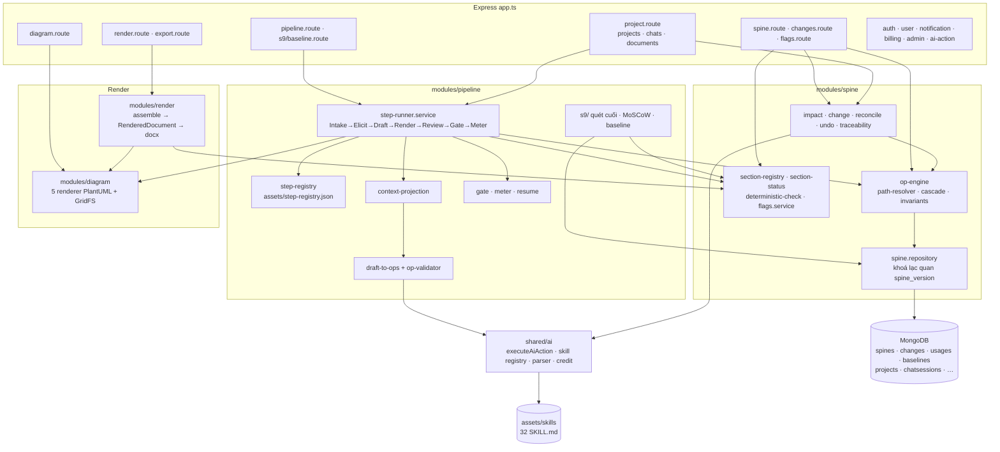
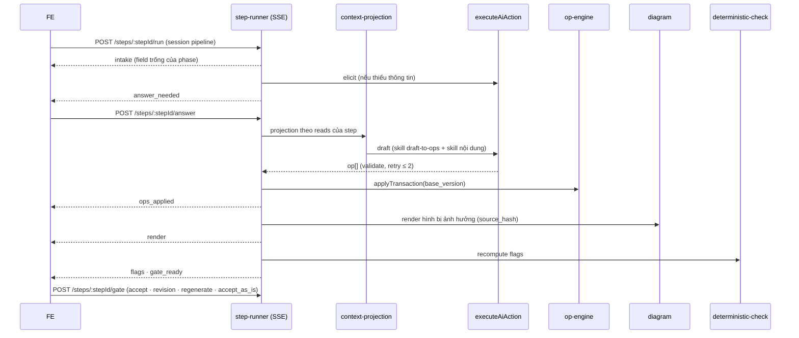
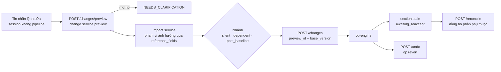

# Kiến trúc Backend FlintFlow

> Hiện trạng sau refactor theo `context/srs-spine.md` + `context/Product-Brief-to-SRS-Phases.md` (T01–T21).
> Mô hình section markdown cũ (`Section`, `SectionVersion`, `VerificationContext`, rollback chat) đã xoá ở
> T21; dữ liệu cũ chuyển bằng `npm run migrate:sections` (xem cuối file).
> Hợp đồng HTTP/SSE chi tiết: [`api/pipeline-contract.md`](api/pipeline-contract.md).

## 1. Một nguồn sự thật: Spine

`Spine` là **một document Mongo mỗi project** (`modules/spine/spine.types.ts`, schema Zod đóng băng ở
`spine.schema.ts`). Nó chứa toàn bộ nội dung SRS có cấu trúc — `project`, `actors[]`, `use_cases[]`,
`features[]`, `screens[]`, `functions[]`, `entities[]`, `nfrs[]`, `business_rules[]`, `messages[]`,
`glossary[]`, `addendum[]`… — cùng state nội bộ `progress`, `steps[]`, `diagrams[]`, `flags[]`,
`sections[]`, `baselines[]`, `spine_version`.

Tách collection vì giới hạn 16MB: `changes` (lịch sử op, đủ `before` để revert), `usages` (lượt gọi model),
`baselines` (snapshot). Project chỉ giữ metadata danh sách (`name`, `domain`, `status`).

**Không lưu giá trị suy diễn**: `status` của section, `% tiến độ`, `awaiting_reaccept` là hàm tính
(`section-status.ts`, `GET /progress`).

## 2. Sơ đồ module



## 3. Luồng ghi duy nhất

```
model → op[] → op-engine.applyTransaction() → Spine mới + changes[] → render/assemble → .docx
```

- **Op**: `set · add · remove · renumber` (user/model) và `clone · migrate · revert` (hệ thống). `path`
  phân giải theo khoá, không theo chỉ số: `actors[id=A03].name`.
- **Transaction**: áp tuần tự trên bản sao → mở rộng cascade tới điểm bất động → kiểm schema và 8 bất biến
  ở **cuối lô** → ghi Spine + `changes[]` trong Mongo transaction. Một lô tăng `spine_version` đúng một lần;
  lô không đổi gì không tăng.
- **Khoá lạc quan**: mọi request ghi mang `base_version`; lệch ⇒ `409 SPINE_VERSION_CONFLICT`.
- Model **không bao giờ** ghi thẳng: parse lỗi chỉ thành thông báo cho lượt retry (≤ 2), không lọt raw text.

## 4. Luồng step (pipeline)

12 phase, `51 step cố định + 5 × N` (N = số màn, +1 nếu có function không thuộc màn):

| Phase | Tên | Step |
|---|---|---|
| B-0 | Intake | 4 |
| B-1 | Product Brief | 6 |
| B-2 | Brief Finalize | 3 |
| S-1 | Analyze & Validate Brief | 4 |
| S-2 | Product Overview | 5 |
| S-3 | User Requirements | 6 |
| S-4 | System Functional Overview | 5 |
| S-5 | Feature & Function Details | 5 × N (`S-5.<n>@<screen_id>` / `@nonscreen`) |
| S-6 | Non-Functional Requirements | 5 |
| S-7 | Requirement Appendix | 4 |
| S-8 | Glossary & Assemble | 4 |
| S-9 | Verify, Validate & Baseline | 5 |



- Trần **8 lượt gọi model/step**, **3 regenerate/step**; Meter ghi `usages` và trừ credit theo lượt.
- Coaching path gate từng step; Fast path gate gộp cuối phase.
- `POST /resume` revert step `in_progress` dang dở khi mở lại workspace.
- Đúng **một** chat session `is_pipeline` mỗi project (partial unique index); session khác chỉ hỏi đáp.
- S-8 assemble tất định; S-9 quét lại, đối chiếu mục tiêu, MoSCoW (`functions[].priority`,
  `nfrs[].priority`), ký baseline khi cờ đỏ = 0 (có waive ⇒ `-conditional`) kèm snapshot.

## 5. Luồng change (sửa qua hội thoại)



Nhánh (`change.service.ts#branchOf`) quyết mức cảnh báo trong preview, không đổi cách áp:
- **silent**: không có phần tử tham chiếu, sơ đồ hay section không-sở-hữu nào bị ảnh hưởng.
- **dependent**: có phần phụ thuộc — áp xong, section đã accept bị ảnh hưởng thành `stale` (hàm tính).
- **post_baseline**: project đã có baseline — mọi sửa đổi đều phải có lý do và thấy phạm vi (UC 6.8);
  snapshot baseline cũ giữ nguyên.

Hoà giải là **một lượt thủ công**: `POST /reconcile` gọi skill của step sở hữu từng section `stale`, trả một
diff gộp; user xác nhận thì áp một transaction, section về `awaiting_reaccept` (step sở hữu
`revision_requested`) chờ gate Accept. Không tự lan toả.

`GET /traceability` dựng đồ thị từ chính `reference_fields[]` — không có bảng quan hệ thứ hai.

## 6. Render & export

- `modules/diagram`: 5 renderer (`context`, `usecase`, `screen_flow`, `erd`, `screen_layout`) sinh `.puml`
  từ field, compile-check qua PlantUML server, lưu SVG/PNG ở GridFS; chỉ render lại khi `source_hash` đổi.
- `modules/render`: `section-registry` (template FPT) → render từng section từ field → `RenderedDocument`
  (JSON, đồng bộ tay với FE) → `docx-writer` (watermark DRAFT với bản nháp). Có cache theo `spine_version`.

## 7. AI & skill

- Mọi lượt gọi model qua `shared/ai/ai-action.service.ts#executeAiAction`: giữ credit → nạp prompt từ đĩa →
  gọi provider → parse Zod theo `ActionType` → trừ/hoàn credit → `AiActionLog`.
- `ActionType` còn lại: khung pipeline (`elicit`, `draft`, `render_fix`, `review`, `regenerate`, `revision`,
  `discovery_step`, `consistency_pass`, `glossary_scan`, `reconcile`, `change_instruction`) và ngoài pipeline
  (`chat`, `summarize_document`).
- Prompt pipeline là skill BMAD ở `assets/skills/<kind>/<id>/SKILL.md` (frontmatter = hợp đồng
  `reads`/`writes`/`output_schema`); prompt phẳng `assets/prompts/` chỉ còn `chat`, `summarize_document`.
  Không có DB override.
- Tài liệu upload: chỉ `extractedText`/`summary` vào prompt, và chỉ với step có token `documents` trong
  `reads` (`document-context.service.ts`). File gốc ở Cloudinary, xoá khi xoá tài liệu hoặc xoá cứng project.

## 8. Nền tảng

`auth` (JWT hai token, Google OAuth), `user`, `credits` (ví, giao dịch, hạn dùng), `billing` (gói, checkout
qua `payment_service`), `notification` (in-app), `admin` (chỉ đọc: users, metrics, chi phí AI).

Xoá cứng project (`DELETE /projects/:id?hard=true`) dọn: chat session, tài liệu (+ Cloudinary), Spine,
changes, baselines, usages, cache render, file sơ đồ GridFS. Notification và PaymentIntent thuộc user nên
giữ lại.

## 9. Dữ liệu cũ

`src/scripts/migrate-sections-to-spine.ts` đọc collection `sections` bằng driver thô và ghi Spine bằng
**một op `migrate`** qua `applyTransaction` (một dòng `changes` với `reason: "legacy import"`, revert được):

| Section cũ | Đích |
|---|---|
| `vision_problem` (hoặc `value_proposition`) | `project.vision` + addendum `fixed:1` |
| `business_goals` | `project.goals[]` (dòng bullet) + addendum `fixed:1` |
| `value_proposition`, `high_level_business_rules`, `scope_out_of_scope` | addendum `fixed:1` |
| `stakeholders`, `user_journey` | addendum `fixed:2.1` |
| `use_case_spec` | addendum `fixed:2.2.2`; bảng markdown parse được còn thêm `actors[]` + `use_cases[]` |
| `screen_flow` / `screen_description`, `functional_requirements`, `user_story`, `acceptance_criteria`, `priority_ranking` / `rbac` / `non_screen_functions` / `erd` | addendum `fixed:3.1.1` / `3.1.2` / `3.1.3` / `3.1.4` / `3.1.5` |
| `external_interfaces` / `non_functional_requirements` | addendum `fixed:4.1` / `4.2.4` |
| `common_business_rules` / `common_requirements` / `application_messages` / `assumptions_risks`, `success_metrics` / `glossary` | addendum `fixed:5.1` / `5.2` / `5.3` / `5.4` / `5.5` |

Chỉ migrate Spine chưa từng ghi (`spine_version = 1`); `progress` giữ B-0.1, `steps[]` rỗng. Lịch sử phiên
bản section cũ không migrate; collection cũ không bị xoá. Báo cáo mỗi lần chạy: `docs/migration-report.md`.
